# Invoice Analysis Automation

## 📊 Project Overview
This project automates the creation of a comprehensive invoice analysis database by consolidating information from multiple SAP exports and Excel source files. The VBA solution categorizes invoices, filters supporting datasets, enriches records with invoice and dispute information, validates financial totals, and automatically generates Area of Responsibility (AOR) reports.

The automation replaces a highly manual reconciliation process that previously required analysts to merge data from several independent reports before performing invoice analysis.

## 💼 Business Problem
Invoice analysts receive information from multiple SAP reports and supporting workbooks, each containing only part of the information required for invoice validation.

Before this automation, analysts manually:
- Categorized invoices
- Filtered multiple SAP exports
- Retrieved invoice details from different files
- Added dispute information
- Merged dispute notes
- Retrieved tax and tariff amounts
- Calculated invoice totals
- Compared calculated totals against SAP invoice values
- Generated reports for each Area of Responsibility (AOR)

This process required extensive copy-and-paste operations, manual lookups, and repeated filtering, making it time-consuming and susceptible to data inconsistencies.

## 📂 Data Sources
- Source        (Purpose)
- Database	    (Master invoice database)
- ZSO_SEARCH	(Invoice line details)
- UDM_Dispute	(Dispute information)
- TAR001	    (Tariff values)
- UDM_Notes	    (Dispute notes)
- VBRP	        (Tax amounts)
- ZREPRINT	    (Official invoice totals)

## ⚙️ Automation Workflow
The VBA automation consolidates seven independent data sources into a single validated invoice database through a four-stage workflow.

Step 1 — Invoice Categorization (first macro)
- The macro analyzes every invoice and classifies it into one of three categories:
    - One-Line Invoice
    - Multi-Line Invoice
    - TLA (Programming Materials)
- This categorization determines how invoice details will be processed during later stages.

Step 2 — Source Preparation (second macro)
- The automation loads and filters the supporting source files: 
    - VBRP
    - TAR001
    - UDM Notes
    - ZREPRINT
- Only relevant records are retained, reducing processing time and improving matching efficiency.

Step 3 — Database Construction (third macro)
- The macro builds the master invoice database by combining information from every source.
    - Primary database:
        - Database.xlsx
    - Supporting sources:
        - ZSO_SEARCH
        - UDM_Dispute
        - TAR001
        - UDM_Notes
        - VBRP
        - ZREPRINT
- The automation automatically populates:
    - Invoice Information
    - Manufacturer Name
    - Manufacturer Part Number
    - Quantity Billed
    - Unit Price
    - Invoice Total
    - Dispute Information
    - Dispute Number
    - Customer Account
    - Customer Segment
    - Dispute Processor
    - Manager
    - Cause of Dispute
    - Purchase Order
    - Sales Order
    - Delivery Order
    - Dispute Notes
    - Financial Information
        - Tax
        - Tariff
        - Invoice Total
- Finally, the macro validates every invoice using the business rule:

    (Qty × Unit Price)  +  Tax  +  Tariff  =  Invoice Total (ZREPRINT)

- Invoices with discrepancies can then be identified for investigation.

Step 4 — Split Database by AOR (forth macro)
- Once the master database has been validated, the macro:
    - Identifies every Area of Responsibility (AOR)
    - Creates a workbook for each AOR
    - Copies only the corresponding invoice records
    - Saves every workbook using standardized naming conventions
- The generated files are immediately ready for analyst review.

Final Result: 
After all four macros have completed successfully, the project produces:
- A validated master invoice database.
- Invoice reconciliation against SAP totals.
- Categorized invoice records.
- Individual databases for each Area of Responsibility.
- Standardized reports ready for business analysis.

## 📈 Key Insights
- Multi-source data integration
- Automated invoice categorization
- Data cleansing and filtering
- Invoice enrichment from six supporting sources
- Automated financial validation
- Tax and tariff reconciliation
- Dispute note integration
- Automatic AOR report generation
- Workbook automation
- Standardized output structure

## 🛠️ Technologies Used
- Microsoft Excel VBA
- Excel Object Model
- Workbook Automation
- Worksheet Manipulation
- AutoFilter
- Dictionaries
- Dynamic Arrays
- Financial Validation Logic
- File System Operations

## 🛠️ Screenshots

### Macro Execution
- The animation below demonstrates the complete automation workflow, from loading the source files to generating the dispute results ready to show.

- Invoice Categorization

- Source Preparation

- Database Construction

- Split Database by AOR

### Macro Worksheet
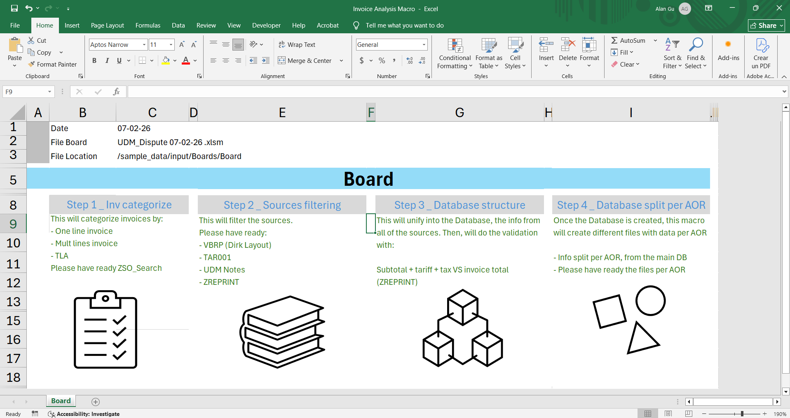

### Source Workbooks
- UDM_Dispute
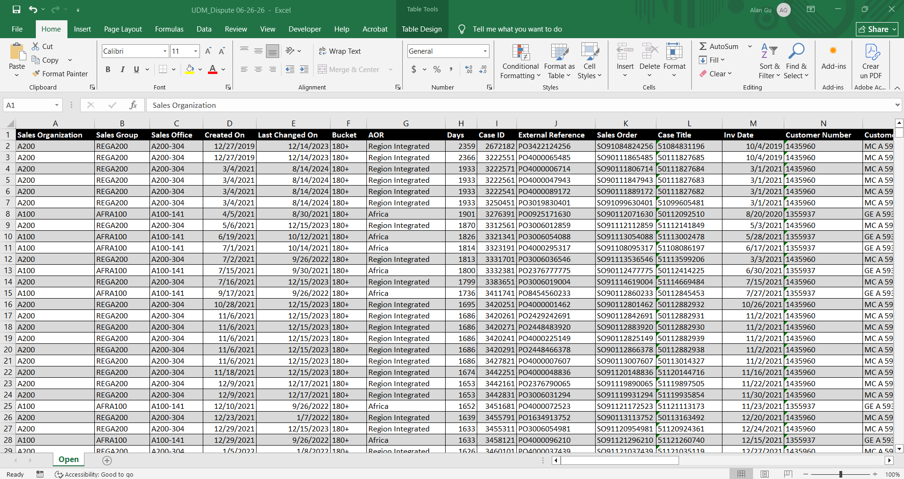

- Database
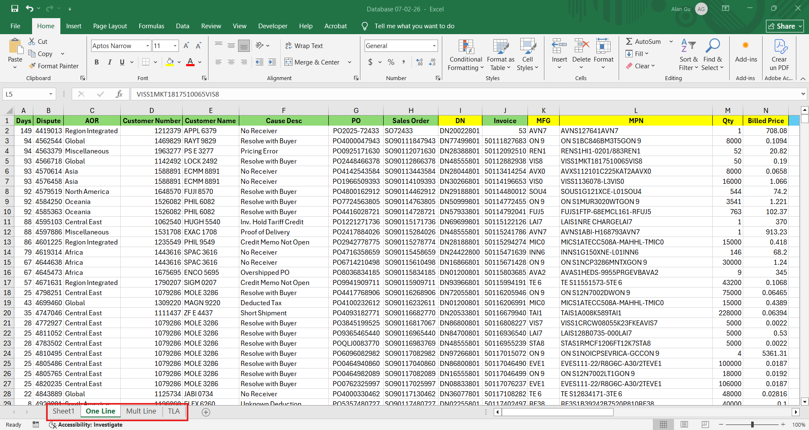

- TAR001
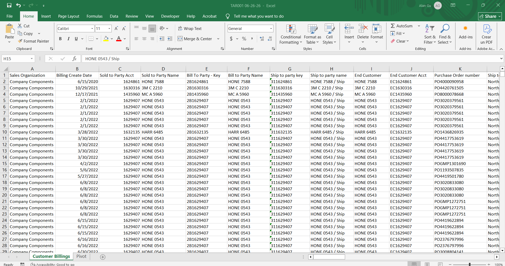

- UDM Notes
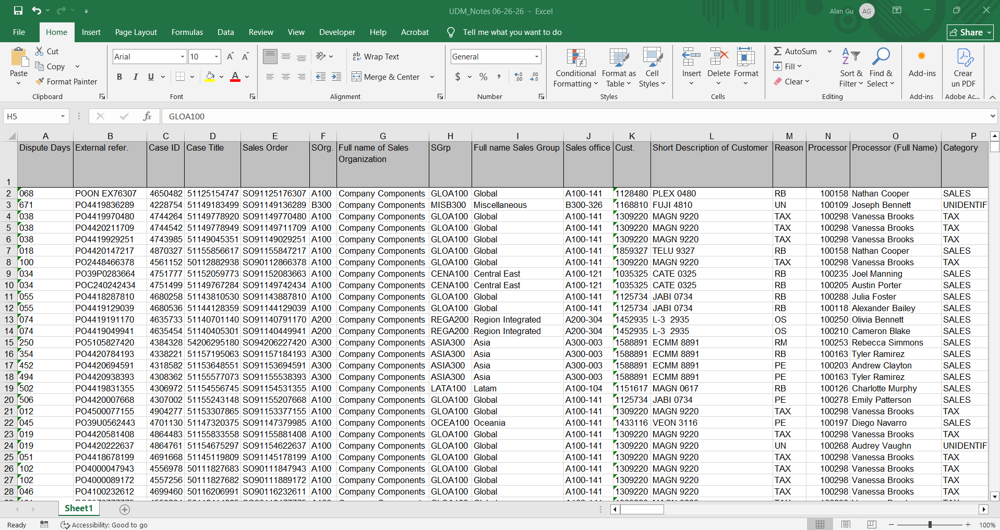

- VBRP
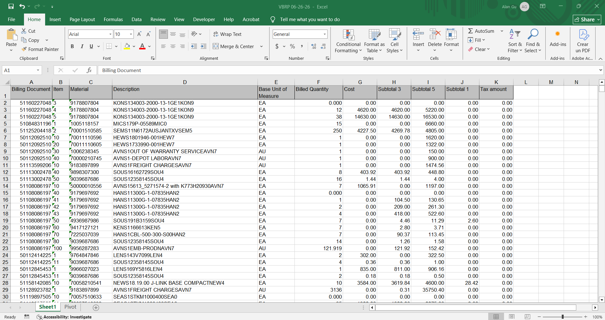

- ZREPRINT
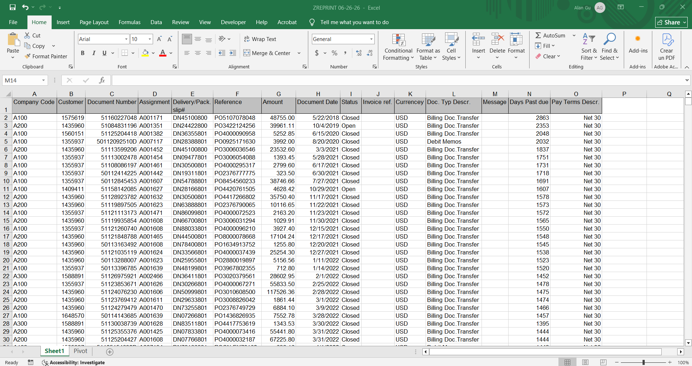

- ZSO_SEARCH
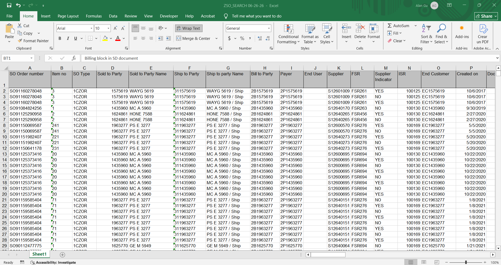

### ZSO_SEARCH file After Running Invoice Categorization Macro
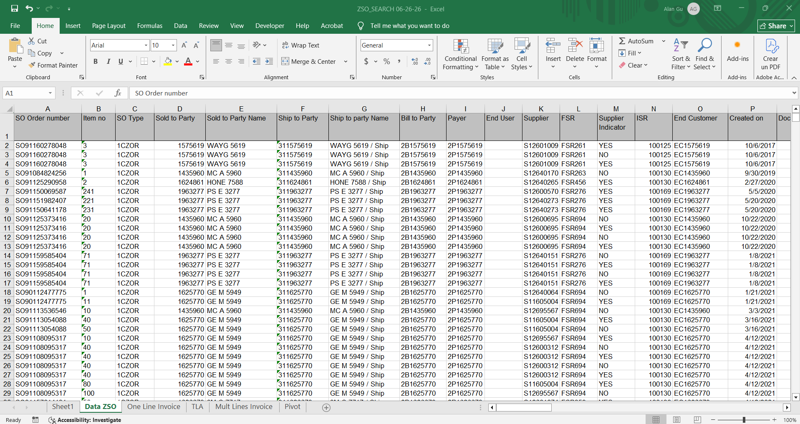

### Source files After Running Source Preparation Macro
- TAR001
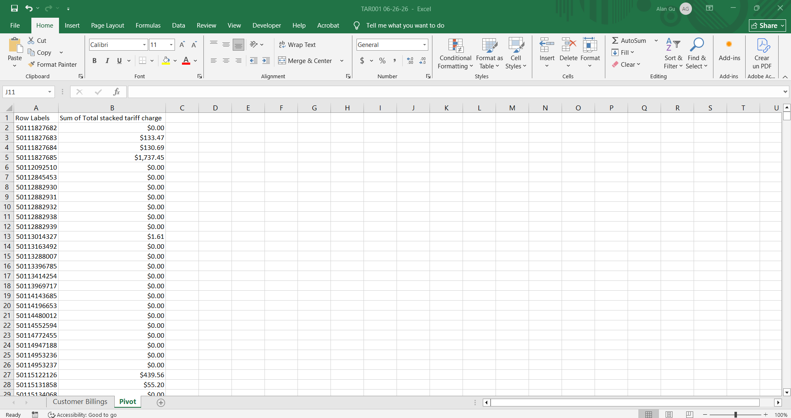

- VBRP
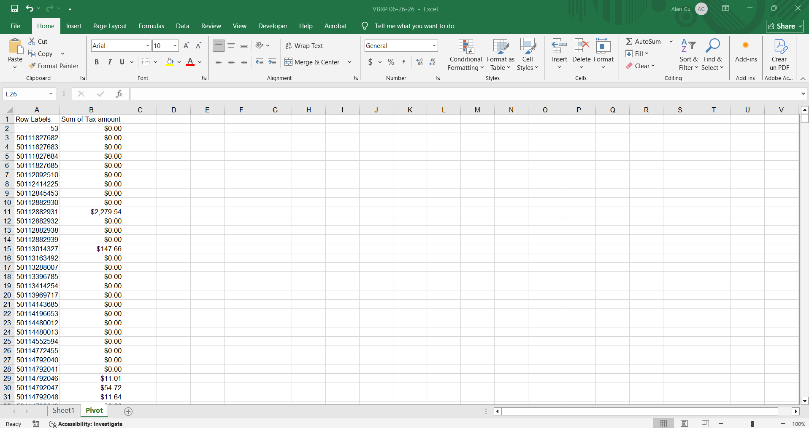

- ZREPRINT
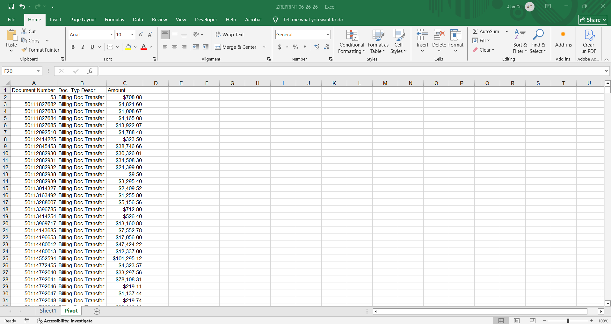

NOTE: the sample files included in this repository contain anonymized data to protect confidential business information.

## 📈 Business Impact
This automation significantly improves the efficiency of the customer invoice analysis by replacing a repetitive manual comparison process with a fully automated workflow.

This automation:
- Eliminates repetitive manual data consolidation
- Reduces invoice preparation time
- Standardizes invoice validation
- Improves financial accuracy
- Reduces reconciliation errors
- Produces ready-to-use reports for each AOR
- Scales efficiently to thousands of invoices

## ▶️ How to Run
1. git clone https://github.com/alangudi417/customer-invoice-analysis-automation.git
2. Open Invoice Analysis Macro.xlsm (Excel workbook where the VBA projects live)
3. Configure source file paths for:
    - UDM_Dispute.xlsm
    - TAR001.xlsx
    - UDM_Notes.xlsx
    - VBRP.xlsx
    - ZREPRINT.xlsx
    - ZSO_SEARCH.xlsx
    - Database (general and per AOR)
- Also configure the output location for the master database and the AOR-specific workbooks.
4. Run Step 1 macro - Invoice Categorization.
    - The macro will:
        - Open the current ZSO_SEARCH workbook
        - Create the required working worksheets.
        - Generate a Pivot Table to summarize invoice data
        - Classify invoices into:
            - One-Line Invoice
            - Multi-Line Invoice
            - TLA (Programming Materials)
        - Save the categorized invoice lists for use in the next stage.
    - Output
        - Categorized invoice worksheets inside the ZSO_SEARCH workbook. 
5. Run Step 2 macro - Source Preparation.
    - The macro will:
        - Standardizing invoice identifiers
        - Preparing lookup tables
        - Creating Pivot Tables for:
            - Tariff values (TAR001)
            - Tax amounts (VBRP)
            - Invoice totals (ZREPRINT)
        - Preparing dispute notes from UDM_Notes.
    - Output
        - The source files are filtered, standardized, and ready for database integration. 
6. Run Step 3 macro - Database Construction
    - The macro will:
        - Clears the previous database contents while preserving the template.
        - Imports invoice information from ZSO_SEARCH.
        - Enriches records with:
            - Dispute information
            - Customer information
            - Tax values
            - Tariff values
            - Dispute notes
            - Official invoice totals
        - Calculates:
            - Subtotal
            - Total Billed
            - Invoice validation
            - Payment differences
            - Applies formatting and data validation rules.
        - The financial validation compares:
            (Qty × Unit Price) + Tax + Tariff = Invoice Total (ZREPRINT)
        - Invoices with discrepancies are automatically flagged for review.
    - Output
        - A fully consolidated and validated master invoice database
7. Run Step 4 macro - Split Database by AOR
    - The macro will:
        - Opens each AOR workbook.
        - Clears previous records while preserving headers.
        - Filters the master database by Area of Responsibility (AOR).
        - Copies the corresponding records into the appropriate workbook.
        - Populates the following worksheet categories:
            - One Line
            - Multi Line
            - TLA
        - Saves and closes all generated workbooks automatically
    - Output
        - Individual invoice databases organized by Area of Responsibility and ready for distribution.